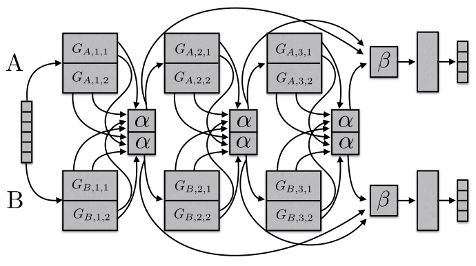

# Sluice networks: Learning what to share between loosely related tasks

Sebastian Ruder, Joachim Bingel, Isabelle Augenstein, Anders Søgaard (2017). 
[Sluice networks: Learning what to share between loosely related tasks](https://arxiv.org/abs/1705.08142). 
arXiv preprint arXiv:1705.08142.



## Installation instructions

The code works with Python 3.5. The main requirement is DyNet (and its 
dependencies).

DyNet can be installed using the instructions [here](http://dynet.readthedocs.io/en/latest/python.html#detailed-instructions)
(the detailed instructions, not TL;DR).

Besides that, we use `progress` to track the training progress, which can be
installed via `pip install progress`.

## Repository structure

- `constants.py`: Contains constants used across all files.
- `predictors.py`: Contains classes for sequence predictors and layers.
- `PTB2chunks.py`: A script to extract chunks from the PTB format.
- `run_sluice_net.py`: Script to train, load, and evaluate SluiceNetwork.
- `sluice_net.py`: The main logic for the SluiceNetwork.
- `utils.py`: Utility methods for data processing.

## Model

The code for the Bi-LSTM we use as basis for SluiceNetwork is based on the 
state-of-the-art hierarchical Bi-LSTM tagger by Plank et al. (2016). You can 
find their repo [here](https://github.com/bplank/bilstm-aux). For most of the 
Bi-LSTM hyperparameters, we adopt their choices.

## Example usage

```
python run_sluice_net.py --dynet-autobatch 1 --dynet-seed 123 \
                         --task-names chunk pos --h-layers 3  --pred-layer 3 3 \
                         --cross-stitch --layer-connect stitch \
                         --num-subspaces 2 --constraint-weight 0.1 \
                         --constrain-matrices 1 2 --patience 3 \
                         --train-dir ontonotes-5.0/train \
                         --dev-dir ontonotes-5.0/development \
                         --test-dir ontonotes-5.0/test \
                         --train bc --test bn mz nw wb \
                         --model-dir model/chunk_3_pos_3_bc_mz --log-dir logs
```

- `--dynet-autobatch 1`: use DyNet auto-batching
- `--dynet-seed 123`: provide a seed to DyNet
- `--task-names chunk pos`: run the model with chunking as main task and POS 
tagging as auxiliary task
- `--h-layers 3`: use 3 layers in the model
- `--cross-stitch`: use cross-stitch (alpha) units
- `--layer-connect stitch`: use layer-stitch (beta) units before the FC layer
- `--num-subspaces 2`: use two subspaces
- `--constraint-weight 0.1`: use subspace orthogonality constraint with a 
weight of 0.1
- `--constrain-matrices 1 2`: place the constraint on the LSTM matrices with 
indices 1 and 2
- `--patience 3`: use patience 3 for training
- `--train-dir`, `--dev-dir`, `--test-dir`: use the specified directories for
training, development, and testing (the `train`, `development`, and `test` 
directories of the CoNLL formatted OntoNotes 5.0 data)
- `--train bc`: train the model on the `bc` domain
- `--test bn mz nw wb`: test the model on the `bn`, `mz`, `nw`, and `wb` domains
- `--model-dir`: the directory of the model
- `--log-dir`: the directory for logging

## Data

We use the [English OntoNotes v5.0 data](https://catalog.ldc.upenn.edu/ldc2013t19)
in the format used by the [CoNLL 2011/2012](http://conll.cemantix.org/2012/introduction.html)
shared task.

In order to obtain the data, you need to follow these steps:
1. Obtain the [OntoNotes v5.0 data](https://catalog.ldc.upenn.edu/ldc2013t19)
from the LDC. Most universities have a copy of it.
2. Convert the data to the CoNLL 2011/2012 format using the scripts [here](http://cemantix.org/data/ontonotes.html).

Following this, you will have a file tree that looks like the following:
```
conll-formatted-ontonotes-5.0/
└── data
   ├── development
   |   └── data
   |       └── english
   |           └── annotations
   |               ├── bc
   |               ├── bn
   |               ├── mz
   |               ├── nw
   |               ├── pt
   |               ├── tc
   |               └── wb
   ├── test
   │   └── data
   │       └── english
   │           └── annotations
   │               ├── bc
   │               ├── bn
   │               ├── mz
   │               ├── nw
   │               ├── pt
   │               ├── tc
   │               └── wb
   └── train
       └── data
           └── english
               └── annotations
                   ├── bc
                   ├── bn
                   ├── mz
                   ├── nw
                   ├── pt
                   ├── tc
                   └── wb
```

A leaf folder such as `bc` has the following structure:

```
bc
├── cctv
|    └── 00
├── cnn
|    └── 00
├── msnbc
|    └── 00
├── p2.5_a2e
|    └── 00
├── p2.5_c23
|    └── 00
└── phoenix
     └── 00
```

Each `00` folder should then contain `*.gold_skel` files containing the CoNLL
skeleton annotations and `*.gold_conll` files containing the word forms and
annotations in CoNLL format.

The `*.gold_conll` files contain annotations for POS tagging, parsing,
word sense disambiguation, named entity recognition (NER), semantic role 
labeling (SRL), and coreference resolution (see
[here](http://cemantix.org/data/ontonotes.html)).
We only use POS tags, NER labels and predicate labels of SRL in our
experiments.

In order to obtain annotations for chunking, run the provided `PTB2chunks.py`
script with the following command:
```
python PTB2chunks.py --original-folder ORIG_FOLDER --conll-folder CONLL_FOLDER
```
where `ORIG_FOLDER` is the root of the original OntoNotes 5.0 data directory 
(where `annotations` is the first subdirectory) and `--conll-folder` is the
`conll-formatted-ontonotes-5.0/` directory above. 

The script will then extract the chunk annotations and create `*.chunks` files
that are saved next to `*.gold_skel` and `*.gold_conll`.

## Reference

If you make use of the contents of this repository, we appreciate citing the following paper:

```
@article{ruder2017sluice,
  title={Sluice networks: Learning what to share between loosely related tasks},
  author={Ruder, Sebastian and Bingel, Joachim and Augenstein, Isabelle and S{\o}gaard, Anders},
  journal={arXiv preprint arXiv:1705.08142},
  year={2017}
}
```
